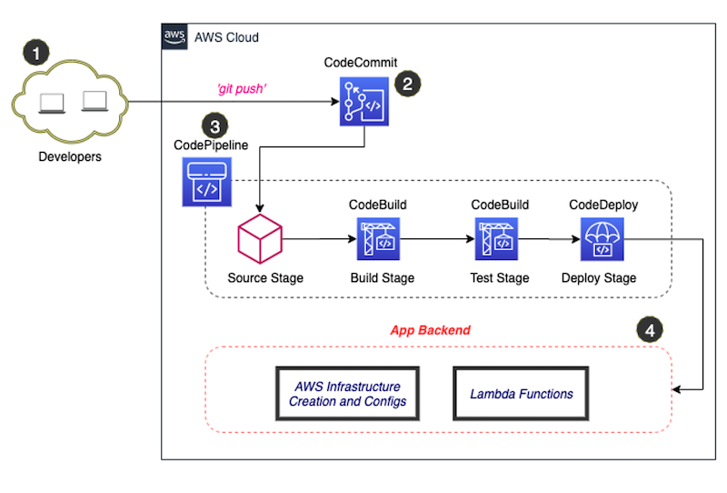

# Serverless Application Model (SAM)

To build Web-apps & Mobile-apps that scale automatically on low-cost, fully-managed Serverless architecture.

## 1.1. SAM-REST

Provide a guidance & inspiration on how to use AWS SAM to develop a Serverless RESTful API.

* [x] [AWS Local Development](https://devsecops.job4u.io/en/serverless/sam-local): [AWS SAM CLI](https://docs.aws.amazon.com/serverless-application-model/latest/developerguide/serverless-sam-cli-install.html) & [Boto3](https://boto3.amazonaws.com/v1/documentation/api/latest/guide/quickstart.html#installation)
    
* [x] [Manual Deploy to AWS](https://devsecops.job4u.io/en/serverless/manual-deploy)

    ```
    cd sam-rest
    ./deploy.sh
    ```
    
## 1.2. SAM-APP

Provide a guidance & inspiration on how to use AWS SAM to develop a simplified development workflows, supporting both ECS/EKS Container and Lambda functions 🎯🚀🌥

* [x] [AWS Local Development](https://devsecops.job4u.io/en/serverless/sam-local): [AWS SAM CLI](https://docs.aws.amazon.com/serverless-application-model/latest/developerguide/serverless-sam-cli-install.html)
    
* [x] [Manual Deploy to AWS](https://devsecops.job4u.io/en/serverless/manual-deploy)

    ```
    cd sam-app
    ./deploy.sh
    ```

## 2. CI/CD Pipeline

Using CDK to create the CI/CD pipeline which consists of the following resources: Amazon CodePipeline, Amazon CodeCommit, Amazon CodeBuild and Amazon CodeDeploy.

<p align="center">
    
</p>
